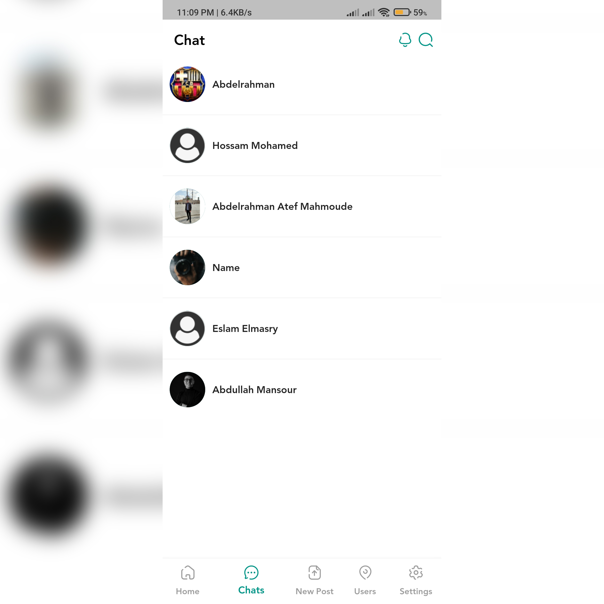
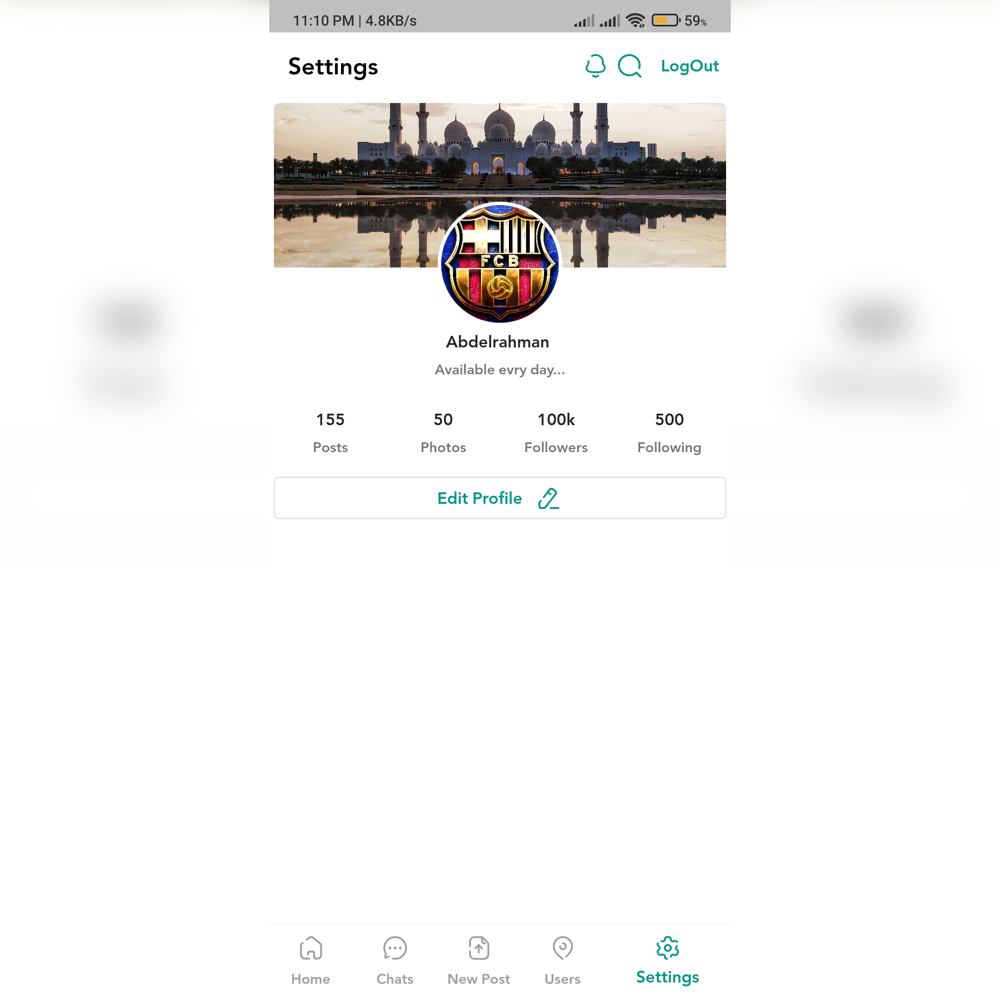
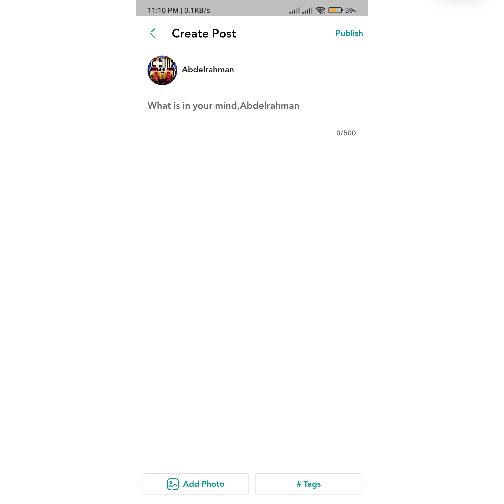
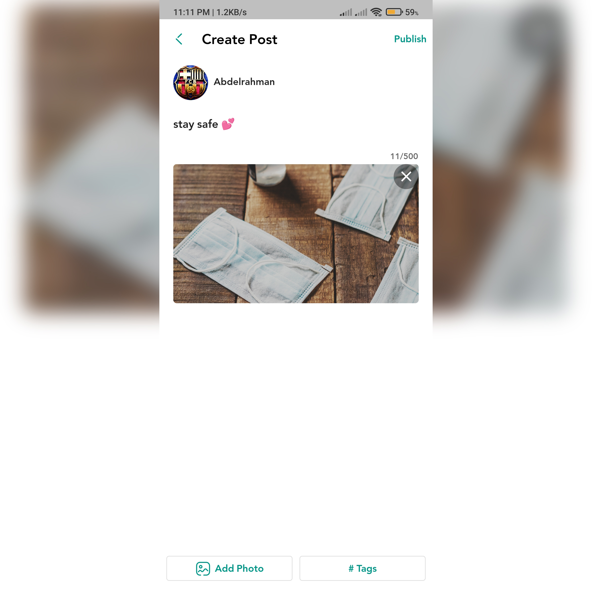
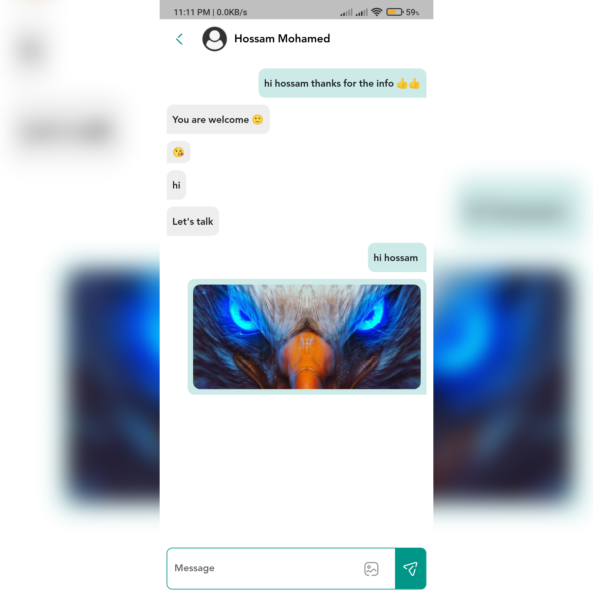
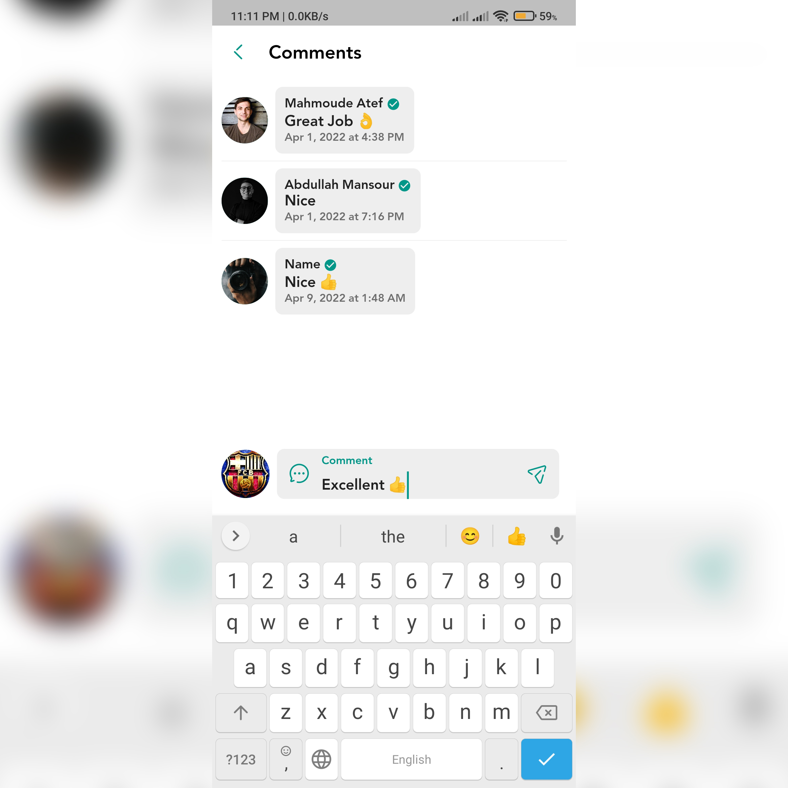

# Social Media App
This app is a social media app with multiple features built with flutter and dart.

## Features
 * Post photo posts from gallery
   * Like posts
   * Download post image
   * Comment on posts
        * View all comments on a post
 * Realtime Messaging and Sending images
 * Deleting Posts
 * Profile Pages
   * Change profile picture
   * Change username
   * Add your own bio
 * Used BLOc to manage state
 

## Screenshots

 
 

 
 

 

# A video showing the functionality of the app.

# What's Next?
 - Animations(liking image)
 - Notifications
 - Follow
 - Stories
 - Saving posts
 - Voice & Video Calling

## Author(s)
**Abdelrahman Atef**
